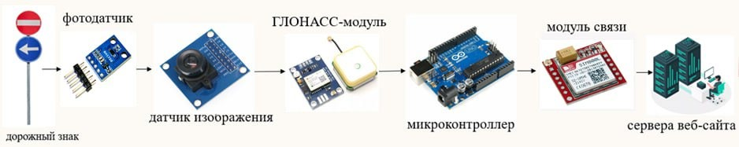

Данный репозиторий посвящен проекту "АСКДЗ-помощник" и служит для показа веб-сайта для отслеживания состояния дорожных знаков

## 📖 О проекте
**АВТОМАТИЧЕСКИЙ МОДУЛЬ СИСТЕМЫ МОНИТОРИНГА ДОРОЖНЫХ ЗНАКОВ «АСКДЗ-ПОМОЩНИК»**

Цель – создание прототипа автоматического модуля системы контроля дорожных знаков 
«АСКДЗ-Помощник» в целях снижения количества ДТП.

Принцип работы модуля системы мониторинга качества дорожных знаков основан на взаимодействии пяти ключевых компонентов: 
фотодатчика, датчика изображения, микроконтроллера, ГЛОНАСС-модуля и модуля связи. 

Фотодатчик измеряет уровень внешней освещённости, чтобы обеспечить адаптивную экспозицию камеры. 
Принцип действия основан на внешнем фотоэффекте: 
падающий свет возбуждает электроны в фотодиоде, создавая ток, пропорциональный освещённости. 

Камера преобразует изображение в цифровую форму 
(матрица CMOS: фотоэлектрический эффект — преобразование света в напряжение).

Из полученного изображения Arduino сможет выделить признаки повреждения: 
низкая контрастность краски, блики, загрязнения и т.д.

Определение координат — модуль NEO‑M6N GLONASS. Фиксирует текущее местоположение автомобиля.
Он получает сигнал от нескольких спутников, 
измеряет время прохождения радиоимпульса и вычисляет координаты по принципу триангуляции.

За передачу отчёта отвечает модуль SIM800L, который отправляет данные в мониторинговую базу ЦОДД через GPRS. 
Передача основана на распространении электромагнитных волн в диапазоне 900…1800 МГц.

Данные о состоянии дорожного знака передаются на сервер, где они могут быть сопоставлены со спутниковой картой.

## 🚀 Ссылки и доступ
**[Открыть сайт на GitHub Pages](https://selimov01.github.io/ASKDZ-helper/)**

### Быстрый переход

Отсканируйте QR-код, чтобы открыть магазин на смартфоне:

## 🛠 Технологический стек

| Технология                                                                                               | Назначение                          |
| :------------------------------------------------------------------------------------------------------- | :---------------------------------- |
|                 | Семантическая структура страниц     |
|                    | Стилизация, анимации и верстка      |
|  | Интерактивность и логика интерфейса |

## 📂 Структура репозитория

- `src/` — Исходный код приложения.
- `assets/` — Графические ресурсы и медиа-файлы.